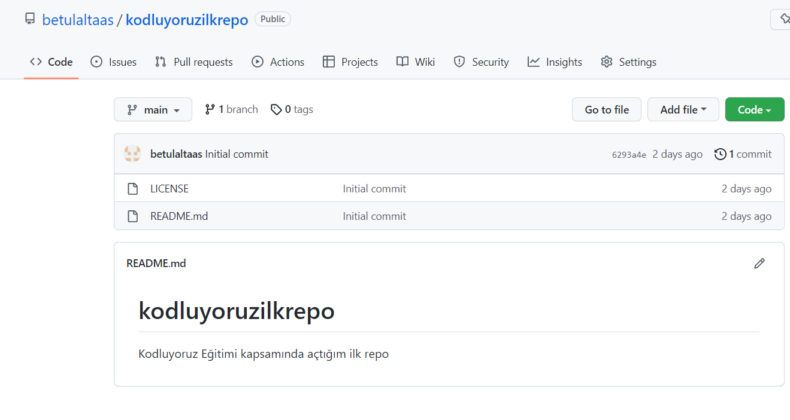

# **Kodluyoruz İlk Repo**

Bu repo [Kodluyoruz](https://app.patika.dev/) Eğitiminde oluşturduğumuz ilk repo.
İçerisinde bir adet README dosyayıs, bir adet de index.html barındırıyor.

## **Installation**
------------------------------------------------------
Öncelikle projeyi clonlayın.
```
git clone https://github.com/betulaltaas/kodluyoruzilkrepo.git
```
### **Usage**
-------------------------
Projeyi clonladıktan sonra Visual Studio Code programın açınız.

Linux için
```
cd kodluyoruz ilk repo
code .
```
## **Contributing**
----------------------
Pull requestler kabul edilir. Büyük değişiklikler için, lütfen önce neyi değiştirmek istediğinizi tartışmak için bir konu açınız.

## **Licesence**
-----------------------
 [MIT](https://choosealicense.com/licenses/mit/)

 


